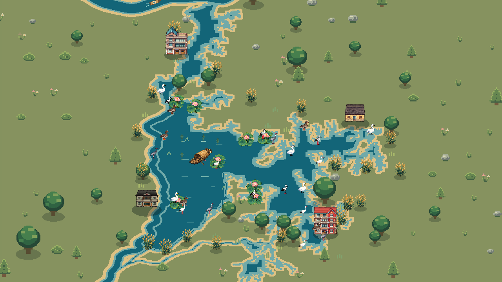
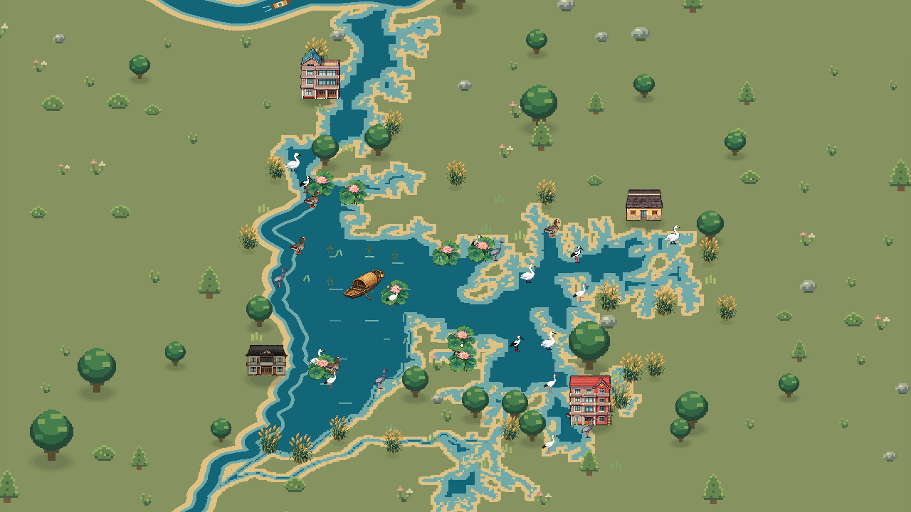

# 地图与接触阴影兼容修复（2026-10-04）

当前地图采用真实45度正交Camera3D投影地面，再叠加直立的2D像素房屋、植物与鸟类。TerrainViewport拥有独立3D世界，地面和河道使用无光照材质；旧场景的DirectionalLight3D不会照进这个独立世界。物件下的影子是2D接触阴影，不能当作完整3D物体的投射阴影。

## 检查发现

- 原先按“草地布景、岸树、植物、房屋、所有鸟类”依次绘制，不能正确表达跨类别物件的前后关系。物件锚点已经通过3D相机投影，但绘制顺序仍保留了旧2D分类方式。
- 阴影半径的像素转UV计算使用已经取整的物件坐标，随后却用浮点坐标生成多边形。缩放时比例会发生阶跃，影子中心也可能与贴图脚点有亚像素偏差。
- CPU对两条河统一使用0.012的水域半宽，而实际绘制的长江、赣江半宽分别为0.017、0.010，存在地形判定与图像不一致的区域。
- 原来的固定水面锚点在退水后仍会画鱼影和波纹；接触阴影没有水域裁切，可以越过岸线。

## 修复

1. 房屋、树、植物、浮岛、船和地面鸟类统一按相机投影的锚点深度排序；同深度使用插入顺序作确定性比较。飞行鸟类单独处于空中层。
2. 新建GroundShadows层，所有接触阴影在直立物件下方绘制。三层低透明度轮廓使边缘更柔和，建筑半径受贴图实际不透明宽度约束。
3. 阴影尺寸使用连续的相机投影；中心跟随贴图取整后的脚点。两层共享缩放变换，窗口变化不会将影子与物件分开。
4. 阴影Shader读取实际TerrainViewport，按已渲染水域裁切，覆盖湖岸动画和河湖连接处。船与浮岛仍不产生接触阴影。
5. 河道判定与渲染共享各自半宽；退水后只在仍有水的锚点绘制鱼影与波纹。
6. 生长或淡出时小于一像素的接触阴影不绘制，之后渐入，避免极小多边形的三角剖分精度错误。该问题在实际行动动画回归中被发现并修复。

所有修改仅在视觉层，不改卡牌效果、生态数值、存档规则或游戏随机序列。影子是风格化接触阴影，不模拟太阳高度或物体轮廓的长投影。透明显著重叠的贴图仍使用2D深度排序，未改成完整3D建筑模型。

## 验证

`python tests/prepare_visual_test.py map_render`创建独立项目和用户目录，使用Godot导入后图形运行。地图测试790项通过，覆盖960×540、1280×720、1600×900，以及菜单/对局的三档缩放、地面与物件定位、阴影尺寸、前后排序、游戏随机序列、河湖交界和水面裁切。17,580个水面像素在开关接触阴影前后均未发生改变。

`sandpan_actions`回归通过：补水、退水、浮岛、植物生长、延迟效果、暂停与真实结算回放；最终日志没有多边形或脚本错误。完整界面回归930项通过。相同地图专项测试在重构前0.1.2的独立工程中也通过790项。

build/保卫鄱阳湖.exe以重构前提交00a3cb8为基础，只替换pixel_wetland.gd和新的接触阴影Shader后导出，保持用户选择的旧版玩法。原始旧版exe另存为保卫鄱阳湖_旧版原始.exe；0.2.0副本保留。

