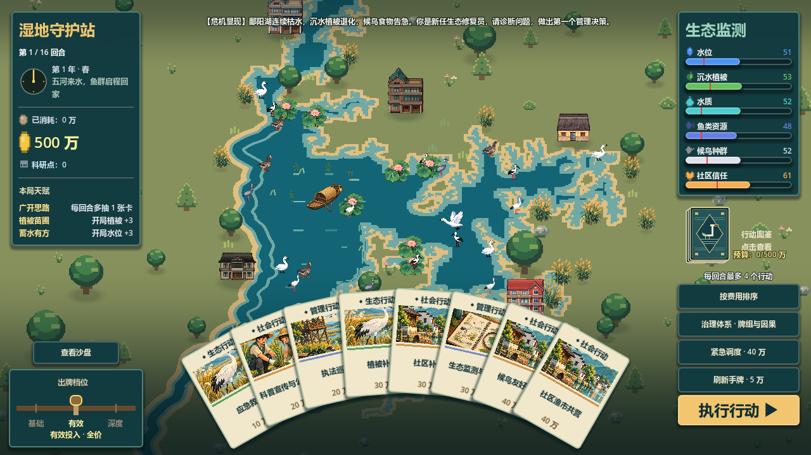
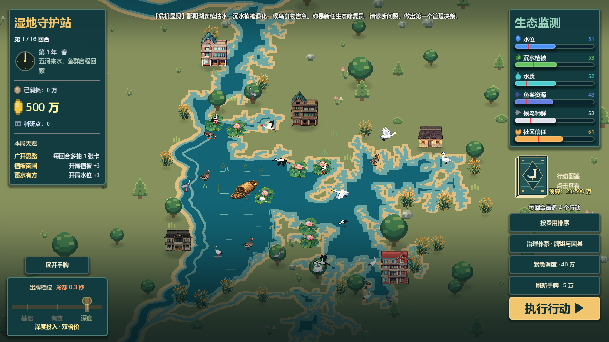

# 沙盘避让手牌与全景查看（2026-10-04）

原布局把扇形手牌叠在全屏沙盘底部。新布局保留手牌尺寸和交互，在出牌阶段根据扇形的固定轮廓（含选中抬起、悬停放大的预留空间）适度上移取景中心。悬停不会重新移动镜头。实际窗口高度不超过600像素时，额外扩大8%的取景范围，用户原有镜头缩放值保持独立。

“查看沙盘”位于左下角档位拉杆上方，空间不足时移至事件横幅下方。点击后手牌用0.26秒滑出画面，按钮改为“展开手牌”；再次点击恢复。地图取景在0.28秒内平滑切换。查看时仍可见资金、生态监测、档位与行动按钮。

手牌通过独立包裹层收起，卡牌局部坐标、尺寸、扇形布局、已选状态、锁定投入档位和牌序均保留。执行行动前恢复包裹层原位，让原有飞牌和结算演出继续运行；结算阶段恢复原取景，新回合再避让手牌。返回菜单恢复全景。

暂停冻结新的手牌和取景动画；快速连续切换会取消上一段动画，从当前位置继续。牌库和紧急调度的面板滑动使用固定布局原位计算避让和新按钮位置，避免捕获半途坐标。新功能不改变卡牌效果、费用、行动次数、知识卡概率、存档格式或游戏随机流。

## 验证

`python tests/prepare_visual_test.py sandpan_view`使用隔离工程和用户目录。60项检查通过，覆盖960×540、1280×720、1600×900、投影与阴影对齐、悬停稳定、卡牌与档位保留、手牌收起/恢复、暂停、快速切换、窗口变化、牌库与紧急调度开关、真实执行行动、跨回合和返回菜单。

完整界面930项、地图790项、补水/退水/浮岛/结算回放以及镜头缩放专项通过。最终修改后的专项测试在保留旧版玩法的独立工程中也通过60项。80步缩放计算耗时341,276微秒，前一轮优化的性能收益保持。

导出以旧版提交00a3cb8为基础，只移植地图、阴影、镜头性能及本次布局功能。导出副本为`build/保卫鄱阳湖_沙盘优化.exe`，已同步替换`build/保卫鄱阳湖.exe`，两个文件SHA256一致，启动检查通过。本版本同步到9.30分支；10.4保留牌组重构的独立版本。

